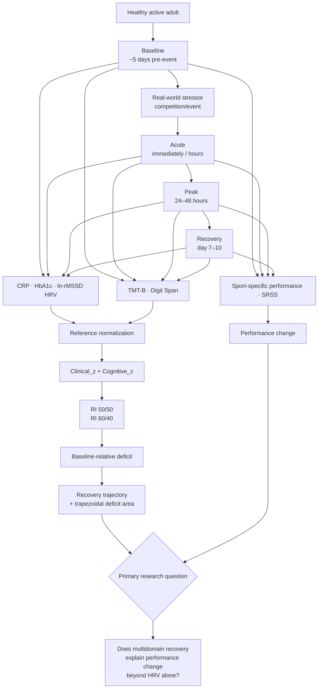

# Resilience Index — Project Diagram

## Scientific architecture

## Interpretation

The project treats resilience as a **trajectory**, not a single snapshot:

**Baseline → Stressor → Response → Recovery**

The pilot first asks whether this trajectory can be measured reproducibly. It then tests whether the multidomain signal contains information about performance change beyond HRV alone.

This is a research architecture diagram, not a clinical decision pathway. It does not imply diagnostic validity or treatment recommendations.
